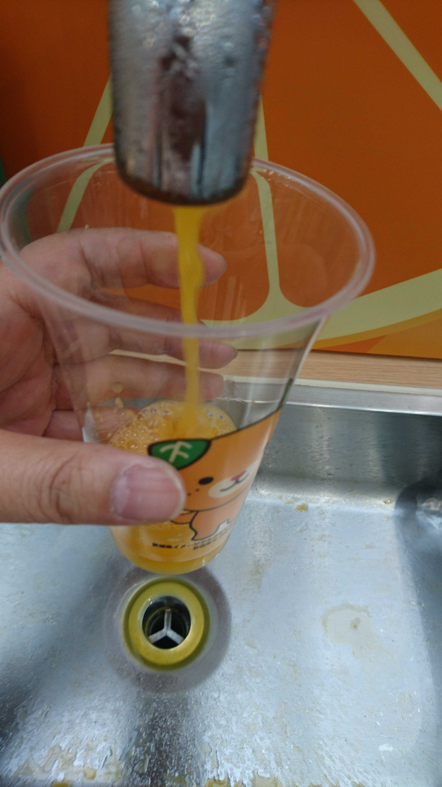
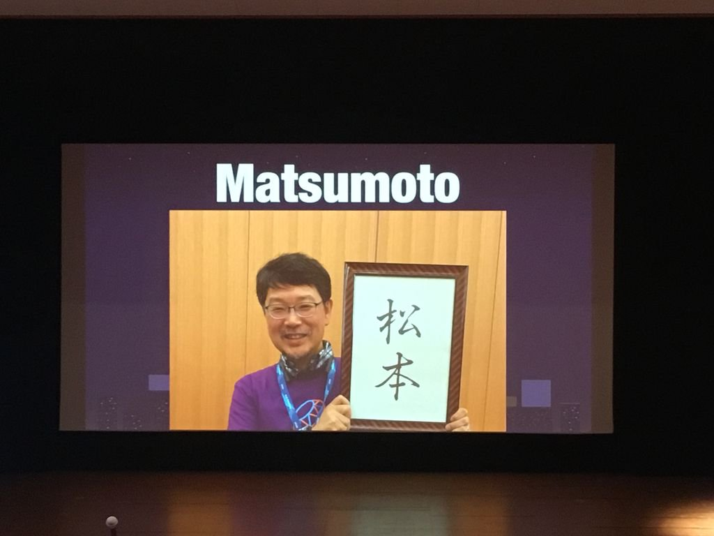
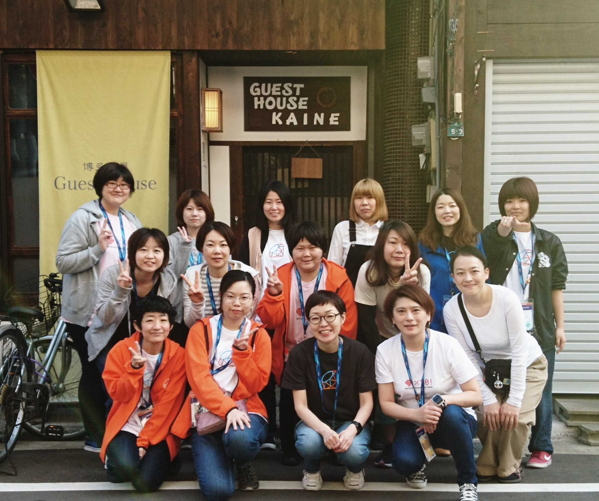

## Rails Girls Japanより耳寄りな情報
##### `Mayumi EMORI (@emorima)`
##### `Rails Girls Ehime 1st Coach LT`

---
#### 自己紹介

* Mayumi Emori (@emorima)
* KCSキャロット グループマネージャ
* 地域コミュニティ Asakusa.rb メンバー
* Rails Girls Tokyo 3rd オーガナイザー(2013/10/18-19)
* Rails Girls Tokyo 4th オーガナイザー(2014/09/21)
* Rails Girls Japan メンバー(2015/07〜)

---
### 東京からやってきました!

---
### Rails Girlsについて

---
## Rails Girlsに必要なもの

* オーガナイザー
* 参加者のみなさん
* コーチ
* スポンサー

---

### Rubyを作ったひと

---

Rubyが好きな人 = Rubyist

---
## RubyKaigi

世界中のRubyistがRubyの話を聞きに来る

---
## RubyKaigi 2020

2020年4月 長野県松本市で開催!

---
でも、私にわかるかな？

---
おそらくわかりません

---
### RubyKaigi とは

「すごすぎて、ぼく、もうわけがわからないよ... でも、みんな楽しそうだね」

---
### RubyKaigi とは

そして翌年には、「わたしも楽しい！」に変わる(変わって欲しい)ところ

---
### RubyKaigi 2020参加支援

Rails Girls Japan で支援します!
* 交通費
* 宿泊費
* RubyKaigi2020 チケット代

---
え、でもひとりで行くの？泊まりで？

---
### エモリハウス

---
### エモリハウス RubyKaigi 2020

既に仮押さえ済

---
### RubyKaigi 2020参加支援

応募開始は、2020年2月以降になる予定

Slackで連絡するのでチェック!
