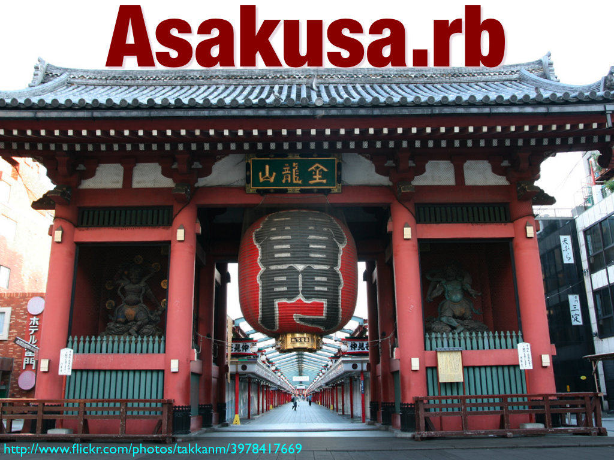

# Rails Girlsのお話や、初めての方向けのコミュニティについてなどお話

theme
:   lightning-simple

author
:   Mayumi Emori(@emorima)

date
:   2019-11-30

content-source
:   鹿児島Ruby会議 01

allotted-time
:   40m

start-time
:   2019-11-30

end-time
:   2025-08-30

# 祝! 鹿児島Ruby会議 #01

開催おめでとうございます!

# self.info

* Mayumi Emori (@emorima)
* 株式会社ケーシーエスキャロット
* 某ガス会社でRubyで作った地震防災システムに携わる(2004～)
  * 倉庫部屋で一人プログラミング
  * 半年くらいで2万行くらい
* 今はExcelと格闘する日々

# 第70回(2010/09/28)〜

{:caption="" relative_height="100"}

## note

2010/09/28 第70回~

# Rails Girls

{:caption="" relative_height="40"}

* Rails Girls Tokyo 3rd & 4th Organizer
* Rails Girls Japan
* Coach: Shiojiri, Matsue, Takasaki, Okinawa, Sendai, Nagano, Ehime

## note

Rails Girls Japan (2015～)

# エモリハウス家主

{:caption="" relative_height="80"}

* RubyKaigi 2016〜

## note

エモリハウス家主(2016～)

# 祝! 初鹿児島!!!

{:caption="" relative_height="80"}

# Rails Girls

{:caption="" relative_height="80"}

# Rails Girls とは

* 2010年11月 Helsinki, Finland
* 世界中で580回以上
  * 今日は Bristol と、Amsterdamで開催

## note

Rails Girlsは、2010年にHelsinkiで開催され、今では580回以上開催されている
女性向けのプログラミングを学ぶワークショップです

今日は、Bristolとアムステルダムで開催されています。

全世界でこれだけ開催されている Rails Girls の目的とするところは、、、

# Rails Girls の目的

Our aim is to give tools and a community for women to understand technology and to build their ideas.

## note

Rails Girls の目的は、テクノロジーを理解し、自分のアイデアを形にするツールとコミュニティを提供することを目的としています。

# 国内でのRails Girls

* 2019/05 Nagano 1st 国内50回目
* 先週    Kyoto 10th 国内57回目
* 2020年
  * Nagoya 5th
  * Ehime 2nd
  * Tokyo 13th

## note

日本国内の開催としては、2012年9月に、東京で開催され、
今年 5月の長野の開催で、国内開催50回目となりました。

先週は、第10回となる京都開催があって、2020年も既に3か所での開催が予定されています。

# 開催 50回記念 Tシャツ

{:caption="" relative_height="110"}

# 開催 50回記念 ステッカー

{:caption="" relative_height="110"}

# 国内のRails Girls開催地域

{:caption="" relative_height="110"}

# 九州でのRails Girls

* 2015/07/24-25 Fukuoka 1st
* 2017/03/10-15 Kitakyushu 1st
* 2019/11/01-02 Fukuoka 2nd
* 2020/?        Kagoshima 1st?

## note

九州では、福岡と北九州で開催されています。

鹿児島では、まだ開催されていませんが、やりたいという方がいらっしゃったので、
少しずつ準備しながら進めていければと思っています。

開催時には、鹿児島や近隣の方々はコーチとしてご協力お願いします！

で、このRails Girlsですが、定期的に開催しているところは1か所もありません。

Rails Girlsを開催したい!というオーガナイザーがいた場合に開催されるんですが、
これだけの開催となっています。

# なぜRails Girlsが開催されるのか?

## note

では、これだけRails Girlsが開催されているのは、なぜなのか...ということなんですが、
それを話す前に、少し昔話をしたいと思います。

# 2014年頃の女性コミュニティのお話

* Rails Girls
* PyLadies Tokyo
* Django Girls
* Java 女子部
* JS Girls
* その他

## note

2014年あたりから、様々な女性コミュニティの活動が活発になりました。
PyLadies Tokyo, Django Girls, Java 女子部, JS Girlsなど
色々な女性コミュニティの活動がSNS上などで目につくようになりました。

そんななか、PyCon JP 2015で女性コミュニティの代表が集まって
パネルディスカッションを行う企画のお話を
PyLadies Tokyoの方から頂きました。

# PyCon JP 2015

いま求められるコミュニティの多様性と未来

{:caption="" relative_height="100"}

## note

2015年のPyConで、「いま求められるコミュニティの多様性と未来」というお題で、
女性コミュニティの代表が集まってパネルディスカッションで登壇もしました。

# 女性コミュニティの意義と課題

* 男性ばかりのコミュニティだと参加しづらいと思う女性のコミュニティ参加へのきっかけ
* 初めてのコミュニティの位置づけのため、技術的なレベルが高いとは言えない

## note

エンジニアの男女比の問題もあり、男性が多くいることで、
通常のコミュニティに参加しずらいと感じる女性が多くいる

当時、コミュニティへの参加の敷居を下げ、
コミュニティに参加してもらうのが
女性コミュニティの共通の意義

しかしながら、初めて参加するコミュニティの位置づけということで、
技術的なレベルが高いものとはいえない

そして、女性コミュニティの活動が活発になった中で、
大きな問題が出てきます。
「女性は今まで差別を受けてきたからというけど、
  女性限定って、男性差別ではないか？」という意見です。

# 女性コミュニティは差別なのか問題

## note

正直、当時、Rails Girls の開催告知をすると、Twitterで誰かが、
「これって男性差別じゃないの?」と言う時期もありました。

Rails Girlsをやりたいというオーガナイザーがいて、
手伝いたいと言ってくれるスタッフや、コーチがいる中で、
こういった発言をされると、とってもモヤモヤするんですね。

# Rails Girls Japan

活動趣旨に Affirmative Actionを掲載

## note

そこで、 Rails Girls Japanのメンバーである
柴田さん、Akiさんと2017年 Rils Girls Japan では、活動趣旨に、
railsgirls.jp のサイトにAffirmative Action を掲載しました。

このAffirmative Actionのページですが、
とてもよくまとめられていると思います。

私自身たまに読み返しているのですが、
せっかくなので、読んでみたいと思います。

# Affirmative Action(1)

> アファーマティブアクション（英: affirmative action）という日本語で積極的格差是正措置と訳される考え方があります。これは弱者集団(たとえば民族、人種、出自による差別、性別により不利益を被ったと思われる集団)の不利な現状を、歴史的経緯や社会環境を考慮した上で是正するための改善措置の事を意味します。

# Affirmative Action(2)

> 日本では、アファーマティブ・アクションの中で、特に女性に対する積極的改善措置のことを、「ポジティブ・アクション (positive action)」と呼び、厚生労働省が中心となって女性の活躍や男女格差解消を推進しています (出典: Wikipedia)

# Affirmative Action(3)

> 単に女性だからという理由だけで女性を「優遇」するためのものではなく、これまでの慣行や固定的な性別の役割分担意識などが原因で、女性は男性よりも能力を発揮しにくい環境に置かれている場合に、こうした状況を「是正」するための取組です。

# Affirmative Action(4)

> 過去、日本では「技術」を女性から遠ざけてきた歴史があります。例えば学校で男子が技術の授業を受けている間、女子が家庭科の授業を受ける教育がそうです。この例では中学では1958年に男子は技術、女子は家庭科必修と定められていましたが、改善措置により1993年に男女とも必修化となりました。

# Affirmative Action(5)

> またソフトウェア業界にも同じような事が言えます。平成22年国勢調査によれば日本のソフトウェア業雇用者男女比は男性 81%に対し 女性19% という調査結果が出ています。日本の男女比が 男性 49% : 女性 51% であることと比較すればアンバランスな状況と言えます。

# Affirmative Action(6)

> 私達 Rails Girls Japan はこれらの活動に賛同し社会的に活動しています。 このアンバランスを改善するべくより多くの女性にIT技術に触れてもらうこと。よりバランスが取れた状態へ、多様性の保たれた業界にしたいと考えています。 皆様のご理解とご協力のほどよろしくお願いします。

# なぜRails Girlsが開催されるのか?

## note

そして、ここで先程のRails Girlsがなぜ開催されるかを考えてみたいと思うのですが、
2014年のコミュニティに参加した頃の自分を振り返ってみたら、
開催されている理由がわかってきました

# プレイバック DevLove甲子園 2014

* ずっと一人でプログラムを書いてきて、ずっとこのままだと思っていた
* Asakusa.rbに参加して、Rubyの話を聞けるのが楽しくなった
* Ruby Friendsができた
* 「世界が変わる」ってことを知った

## note

2014年に、プレイバック DevLove甲子園で、Rails Girlsのお話をしてきました。

当時、Tokyo 4thを終えた後で、自分が感じたことを率直にお話したんですが、
こんなお話をしてきました。

Rails Girlsは先程話したように、開催したいという方がいないと開催されないため、
開催したいと思う方が、毎年いる、
そして嬉しいことに、新しい都市での開催も年々増えています。

オーガナイザーの方になぜ、開催したいかと思ったかとお話したら、
Rails Girlsをはじめ、コミュニティに参加されている方は、
「コミュニティに参加して、本当に楽しかったから、
  自分ができる恩返しが、Rails Girlsの開催だった」という方が多くいらっしゃいます。

# Rails Girlsはコミュニティ

初めてのRubyコミュニティ

初めての越境

## note

また、初めて地域で開催される方は、地元でRailsを学ぶコミュニティが欲しかったとお話されます。

# PyConf JP 2015から4年

変わらないことと、変わったこと

## note

意義と課題については、今も変わりません。

初めてRubyコミュニティにハードルを下げるという意義は今も変わらなっていないです。

しかしながら、継続して学べる場所として 
スプラウト.rbや、Ehime.rb などコミュニティをたちあげたり、
元々あった休眠中のコミュニティを再立ち上げした Nagano.rbや、Sendai.rbと
Rails Girlsだけではなく、其の先の地域Rubyコミュニティに関わる女性が増えてきたのは、
とても大きな変化だと想います。

# Rails Girlsが目指すところ

女性限定のコミュニティを作りたいのか?

## note

女性のみのコミュニティを作りたいわけではありません。

先程のAffirmative Actionのお話もしましたが、
あくまでも是正措置としての活動と考えています。

女性エンジニアが増え、地域Rubyコミュニティの男女比が気にならないくらいになる時には、
Rails Girlsではなく、地域Rubyコミュニティへ参加してもらえると思っています。

しかしながら、開催回数を重ねた開催地域以外であったり、
初めて開催する地域では、地元の女性のコーチもいないのが現状なので、
まだRails Girlsの活動は続いていきます。

Rails Girlsは地域Rubyコミュニティの方々の協力なしでは、開催が難しいです。

皆さんの地域でRails Girlsが開催される時には、
是非ご協力お願いします。

# ちょっと休憩

ここで水を飲みます!

# Rubyコミュニティ

みんなが違和感を感じることなく、
Rubyを楽しめる場所

Matz is nice, so we are nice.

# 初めてのMeetup 参加

知り合いを作っておくと参加しやすい

# 鹿児島Ruby会議#01(地域Ruby会議)

* 地域Rubyコミュニティの生活発表会、お祭り
* 懇親会もあるから、そこでお話してみる!

# #rubyfriends

{:caption="" relative_height="110"}

## note

自撮り棒買ってきた

# RubyKaigi

{:caption="" relative_height="110"}

## note

さて、Rubyのコミュニティに入ったら、世界中のRubyistに会える RubyKaigiにも参加したくなってくるじゃないですか。

松田さんが RubyKaigiはお祭りなんでとよく言われるんですが、
本当にRubyistが集まった年に１回のお祭りなんで、とても楽しいです。
開催地、日本酒が美味しいところが多いですし、、、

RubyKaigiに会社のお金で行かせてくれる素晴らしい会社もありますし、
Rails Girls Japanでも、2017年から、Rails Girlsイベントの参加者の中から、
RubyKaigi への参加希望を募り、参加支援を行っているんですが、

是非、またRubyKaigiでもお会いしたいです。

なんで、急にRubyKaigiの話をしたかといいますと、
エモリハウスのお話を少しさせてください。

# エモリハウス

emori.house

## note

エモリハウスは、RubyKaigi期間中、
RubyKaigiに参加する女性達で一緒に貸切のゲストハウスに泊まる宿で、
RubyKaigiが 東京から地方に行った時に始めた
最初は、知り合いに声かけたのが始まり
(日本旅館に泊まって枕投げとかしたかった)

地域Rubyコミュニティに参加していても、
女性が一人で地方都市に泊まって
Rubykaigiに参加したいか...と言われると
どうかなーと思うところもあるかもしれません

RubyKaigiに参加した女性で、夜もワイワイできたらいいなーという想いもあって、
サイトを作り、公募しています。

RubyKaigi参加したいけど、知り合いいないから参加どうしようかな...
から、エモリハウスおもしろそうだし、
ちょっとRubyKaigi参加してみようかな...になってもらえれば嬉しいなと思っています。

事前にリモート飲み会を開催もするので、
お近くの女性でRubyKaigiに参加するのを迷っている方がいらっしゃったら、
ご紹介してみてください。

## note 日本旅館の場合の課題(2016 京都、2017 広島)

* 寝たい人とお話したい人が同じスペースに存在する
* 他のメンバがDrinkUpに出かけてしまい、大部屋に一人という状況が発生する
  * DrinkUpから帰ってきた時に、フロントを起こす必要がない

## note ゲストハウス(2018 仙台、2019 福岡)

* 安い
* 物理鍵からの開放
* 寝室では飲食禁止なので、話したい人はロビーで話す
  * ロビーなら宿泊者以外もOKなので、友達が遊びに来る
* キッチンの使用がOKの場所であれば、ご飯も作れる

